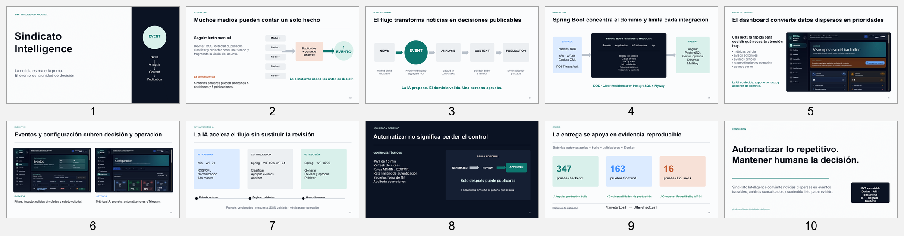

# Sindicato Intelligence

Plataforma interna de inteligencia informativa para un sindicato docente de Andalucía. Automatiza la captura y el seguimiento de noticias educativas, consolida publicaciones duplicadas en eventos, genera análisis asistidos por IA y prepara contenidos para revisión humana y publicación en Telegram.

> Estado de entrega TFM actualizado el 26/07/2026. La aplicación y sus pruebas
> están verificadas localmente, el repositorio es público y las slides están
> publicadas. Antes de enviar el formulario todavía debe grabarse y publicarse
> el vídeo.

## Enlaces de entrega

| Entregable | Estado | Ubicación |
| --- | --- | --- |
| Código fuente | Público y verificado el 26/07/2026 | <https://github.com/titiantonio/sindicato-intelligence> |
| Aplicación desplegada | No disponible públicamente | Ejecución local reproducible con Docker |
| Slides | Públicas y verificadas el 26/07/2026 | [Presentación web](https://titiantonio.github.io/sindicato-intelligence/slides/tfm_presentacion.html), [PDF](https://github.com/titiantonio/sindicato-intelligence/blob/main/slides/sindicato_intelligence_tfm.pdf) y [`PPTX`](slides/sindicato_intelligence_tfm.pptx) |
| Vídeo explicativo | Pendiente de grabar y publicar | Guion en [`docs/Documentacion_Final/2026_07_25_guion_video_tfm.md`](docs/Documentacion_Final/2026_07_25_guion_video_tfm.md) |
| Informe de preparación | Disponible | [`docs/Documentacion_Final/2026_07_25_informe_preparacion_entrega_tfm.md`](docs/Documentacion_Final/2026_07_25_informe_preparacion_entrega_tfm.md) |
| Checklist de cierre | Disponible | [`docs/Documentacion_Final/2026_07_26_checklist_cierre_entrega_tfm.md`](docs/Documentacion_Final/2026_07_26_checklist_cierre_entrega_tfm.md) |

Cuando el vídeo esté publicado, añade su URL pública antes de entregar.



## Problema y solución

El seguimiento manual de medios, boletines y fuentes sindicales obliga a revisar muchas noticias repetidas y dificulta mantener una visión consolidada de cada asunto educativo.

Sindicato Intelligence transforma ese trabajo en un flujo trazable:

```text
Fuentes RSS
  -> WF-01 n8n: captura
  -> Spring Boot / PostgreSQL
  -> clasificación IA
  -> agrupación en eventos
  -> análisis consolidado
  -> generación de contenido
  -> revisión humana
  -> publicación Telegram
```

La entidad central es `Event`. Las noticias son materia prima: varias noticias sobre una misma convocatoria deben producir un único evento, un único análisis consolidado y una única pieza editorial.

## Funcionalidades principales

- Captura de noticias RSS/XML mediante el único workflow externo de n8n, `WF-01-Capture-News`.
- Alta manual y masiva de noticias con deduplicación por URL.
- Clasificación asistida por IA con taxonomía educativa oficial.
- Detección y agrupación de noticias relacionadas en eventos.
- Análisis IA consolidado con validación de respuesta y métricas operativas.
- Generación de contenido desde eventos, con edición, aprobación o rechazo.
- Publicación inmediata y programada en Telegram.
- Mensajes manuales de Telegram con destinos y adjuntos.
- Dashboard operativo, gestión de fuentes, usuarios, auditoría y configuración.
- Configuración dinámica de automatizaciones `WF-02`, `WF-03` y `WF-04`.
- Autenticación JWT, refresh token, recuperación y cambio obligatorio de contraseña.
- Roles `ADMIN` y `EDITOR`, con autorización aplicada en backend.
- Auditoría de acciones administrativas, editoriales y de publicación.
- Modos claro y oscuro, navegación responsive y controles accesibles.

## Arquitectura

El backend usa DDD, Clean Architecture y monolito modular:

```text
module
  domain          negocio puro
  application     casos de uso y puertos
  infrastructure  PostgreSQL, JPA, IA, Telegram y adaptadores
  api             REST, DTOs y validación HTTP
```

Módulos principales:

```text
source · news · classification · event · analysis · content · publication
user · auth · automation · ai · audit · dashboard · health · core
```

Responsabilidades:

- Spring Boot contiene las reglas de negocio, casos de uso, seguridad, automatizaciones e integraciones.
- Angular consume la API REST y ofrece el backoffice.
- PostgreSQL persiste el modelo físico y Flyway gestiona el esquema.
- n8n solo captura RSS/XML mediante `WF-01`.
- La IA apoya clasificación, agrupación, análisis y contenido; no aprueba ni publica por sí sola.

## Stack tecnológico

| Capa | Tecnologías |
| --- | --- |
| Backend | Java 21, Spring Boot 3.5.14, Maven, Spring Security, JWT, Spring Data JPA, Flyway, SpringDoc OpenAPI |
| Frontend | Angular 21.2, TypeScript, PrimeNG 21, Tailwind CSS 4 |
| Datos | PostgreSQL 17 |
| Automatización | n8n para `WF-01`; schedulers dinámicos Spring para `WF-02` a `WF-04` |
| IA | proveedor determinista local y adaptador Gemini configurable |
| Publicación | Telegram Bot API |
| Calidad | JUnit 5, Mockito, Karma/Jasmine, Playwright |
| Infraestructura | Docker Compose, Nginx y Proxmox como destino de producción |

## Puesta en marcha recomendada

### Requisitos

- Git.
- Docker Desktop con Docker Compose.
- PowerShell 7 o Windows PowerShell.
- Puertos libres `4200`, `8080`, `5432`, `5678`, `8025` y `1025`.

### Inicio completo

```powershell
git clone https://github.com/titiantonio/sindicato-intelligence.git
cd sindicato-intelligence
.\tfm-start.ps1
```

El script:

1. crea `.env` desde `.env.example` si no existe;
2. construye e inicia PostgreSQL, MailHog, backend, frontend y n8n;
3. espera a que los servicios estén disponibles;
4. importa `WF-01-Capture-News` en n8n si todavía no existe.

### Comprobación

```powershell
.\tfm-check.ps1
```

### Parada y reinicio de datos

```powershell
.\tfm-stop.ps1
```

El reinicio completo elimina los volúmenes locales y debe usarse solo cuando se quieran regenerar los datos:

```powershell
.\tfm-reset.ps1
```

## Servicios locales

| Servicio | URL |
| --- | --- |
| Backoffice | <http://localhost:4200> |
| API health | <http://localhost:8080/api/v1/health> |
| Swagger UI | <http://localhost:8080/swagger-ui/index.html> |
| n8n | <http://localhost:5678> |
| MailHog | <http://localhost:8025> |

## Usuarios de demostración

Las credenciales siguientes pertenecen solo al entorno local inicial:

| Rol | Usuario | Contraseña |
| --- | --- | --- |
| `ADMIN` | `admin@sindicato.es` | `Admin@12345` |
| `EDITOR` | `editor@sindicato.es` | `Admin@12345` |
| Servicio n8n | `n8n@sindicato.es` | `Admin@12345` |

No deben reutilizarse en producción. Sustituye todas las claves, contraseñas y secretos de `.env` antes de exponer el sistema.

## Ejecución para desarrollo

La ruta Docker anterior es la recomendada para evaluación. Para desarrollo local:

```powershell
.\dev-start.ps1
```

También se pueden ejecutar los componentes por separado:

```powershell
cd backend
.\mvnw.cmd spring-boot:run
```

```powershell
cd frontend
npm install
npm start
```

## Pruebas

### Backend

```powershell
cd backend
.\mvnw.cmd test
```

### Frontend unitario y build

```powershell
cd frontend
npm test -- --watch=false --browsers=ChromeHeadless
npm run build
```

### Playwright con API simulada

```powershell
cd frontend
npm run e2e:mock
```

Las suites mockeadas no llaman a IA ni a Telegram reales. Las pruebas contra backend real son opt-in y están documentadas en [`frontend/e2e/README.md`](frontend/e2e/README.md).

Resultados de la auditoría del 25/07/2026:

- backend: 347 pruebas;
- frontend Karma/Jasmine: 163 pruebas;
- Playwright mock: 16 pruebas;
- build Angular de producción correcto;
- `npm audit --omit=dev`: 0 vulnerabilidades de producción;
- validación sintáctica de `WF-01` y scripts PowerShell correcta.

El resultado definitivo de la batería completa y las incidencias conocidas se mantiene en el [informe de preparación](docs/Documentacion_Final/2026_07_25_informe_preparacion_entrega_tfm.md).

## Configuración de IA y Telegram

Por defecto, el entorno local usa un proveedor IA determinista y Telegram está deshabilitado. Esto permite evaluar el flujo sin consumir servicios externos.

Para usar Gemini:

1. copia los valores necesarios a `.env`;
2. establece `AI_PROVIDER=gemini`;
3. configura `GEMINI_API_KEY`;
4. reinicia el backend.

Para Telegram:

1. configura el bot y los destinos desde `/settings`;
2. proporciona el token mediante variables de entorno o almacenamiento cifrado;
3. habilita la integración únicamente en un entorno seguro.

Nunca se deben versionar secretos reales.

## Estructura del repositorio

```text
.
├── backend/                 API Spring Boot, dominio, casos de uso y Flyway
├── frontend/                backoffice Angular y pruebas Playwright
├── database/                soporte de PostgreSQL para desarrollo
├── n8n/                     WF-01 y validador del workflow
├── docs/                    documentación técnica y de entrega
├── slides/                  presentación TFM y capturas actuales
├── skills/                  instrucciones especializadas del proyecto
├── docker-compose.yml       stack completo reproducible
├── tfm-start.ps1            inicio de evaluación
├── tfm-check.ps1            comprobación de servicios
├── tfm-stop.ps1             parada del stack
└── tfm-reset.ps1            reinicio controlado de datos
```

## Documentación

- [Índice documental](docs/indice_documentacion.md)
- [Guía de ejecución para evaluación](docs/guia_ejecucion_tfm.md)
- [Manual operativo](docs/Documentacion_Final/Manual_Operativo_Usuario.md)
- [Arquitectura y fases del MVP](<docs/Documentacion Proyecto/Documento 30 – MVP Técnico Ejecutable.md>)
- [Plan de implementación detallado](<docs/Documentacion Proyecto/Documento 31 - Documento 31 – Plan de Implementación Detallado.md>)
- [Changelog](CHANGELOG.md)

## Seguridad y límites del entorno de demostración

- El acceso a la API está protegido con JWT salvo endpoints públicos expresos.
- Los tokens de acceso duran 15 minutos y los refresh tokens 7 días.
- Los endpoints administrativos se validan en Spring Security.
- Las respuestas de IA se validan antes de persistirlas o usarlas.
- Los secretos de IA, Telegram, JWT y n8n no se registran en logs.
- Swagger está habilitado para la evaluación local; debe restringirse en producción.
- El despliegue público con Nginx/Proxmox y la gestión de secretos productivos siguen siendo tareas de operación, no requisitos para ejecutar la entrega local.

## Licencia

El repositorio ya es público, pero todavía no incluye una licencia de software.
Decide si se mantendrá únicamente para evaluación académica o si se añadirá una
licencia explícita como MIT. No se debe añadir una licencia sin validar
previamente la titularidad y las condiciones del TFM.
