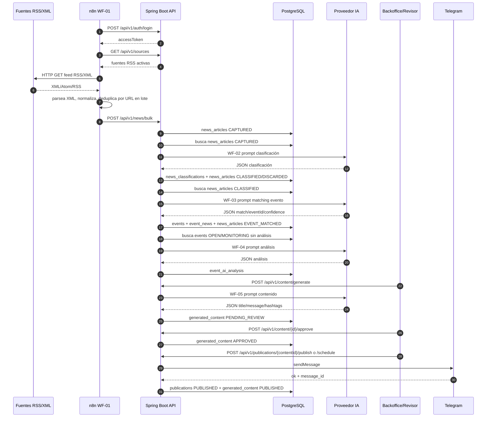
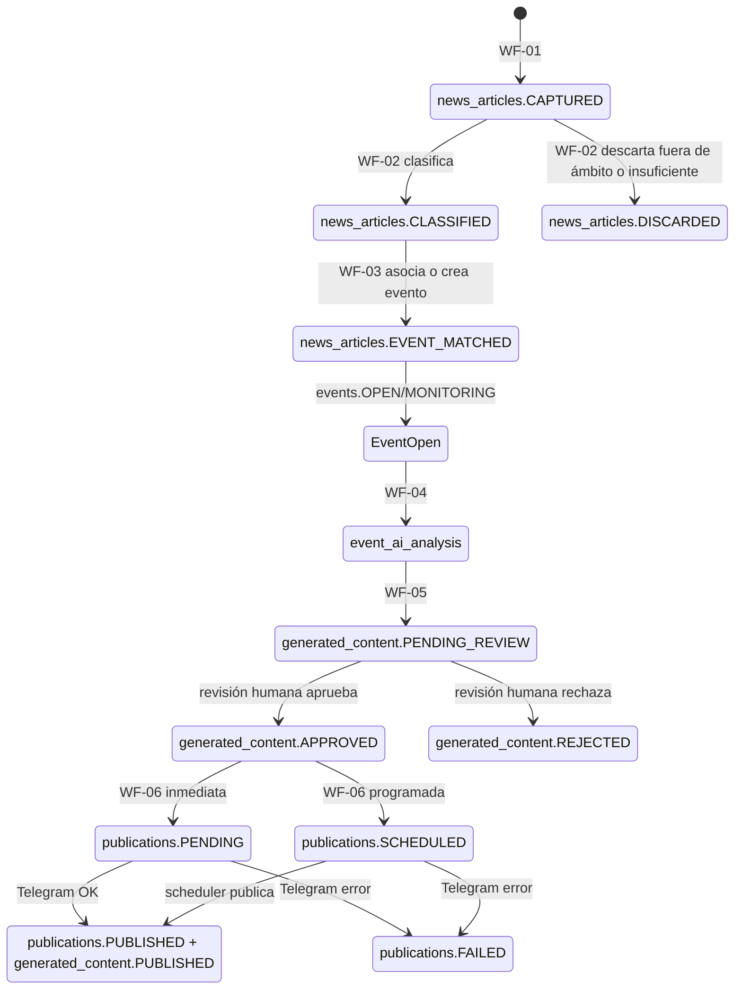
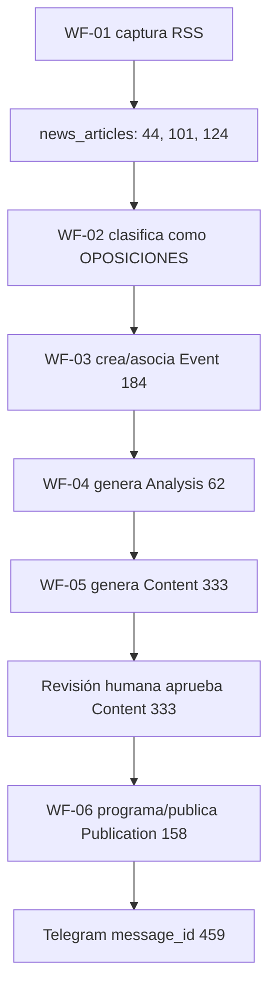

# Flujo completo WF-01 a WF-06

Fecha: 2026-06-27

Este documento describe el flujo operativo completo desde la captura de noticias RSS en n8n hasta la publicación final en Telegram desde Spring Boot.

Flujo oficial:

```text
Fuentes RSS
  -> WF-01 n8n Captura Noticias
  -> Spring Boot / PostgreSQL
  -> WF-02 Clasificación IA
  -> WF-03 Agrupación en eventos
  -> WF-04 Análisis IA
  -> WF-05 Generación de contenido
  -> Revisión humana
  -> WF-06 Publicación Telegram
```

La entidad principal del sistema es `Event`. Las noticias son materia prima; el análisis, el contenido y la publicación se construyen alrededor del evento.

## 1. Visión general

Responsabilidades:

| Componente | Responsabilidad |
| --- | --- |
| n8n | Ejecuta solo `WF-01-Capture-News`: lee RSS/XML, normaliza items básicos y llama al backend. |
| Spring Boot | Contiene la lógica de negocio, automatizaciones internas `WF-02` a `WF-06`, validaciones, seguridad, auditoría e integraciones. |
| PostgreSQL | Persiste fuentes, noticias, clasificaciones, eventos, análisis, contenidos, publicaciones, configuración y métricas IA. |
| IA | Apoya clasificación, matching de eventos, análisis y generación de contenido; no decide fuera de las reglas del dominio. |
| Backoffice Angular | Permite operar fuentes, eventos, contenido, publicaciones, auditoría, configuración y ejecuciones manuales. |
| Telegram | Canal social activo del MVP. Recibe solo contenido aprobado. |

Diagrama de secuencia:



Diagrama de estados funcional:



## 2. WF-01 - Captura de noticias en n8n

Nombre: `WF-01-Capture-News`.

Ubicación: `n8n/workflows/wf_01_capture_news.json`.

Responsabilidad: capturar noticias desde fuentes RSS/XML activas y enviarlas al backend en lote. No aplica IA ni reglas de negocio complejas.

Disparador:

```text
Schedule Trigger cada 30 minutos
```

Pasos reales del workflow:

| Paso n8n | Entrada | Salida |
| --- | --- | --- |
| `Authenticate Backend` | `BACKEND_N8N_AUTH_EMAIL`, `BACKEND_N8N_AUTH_PASSWORD` | `accessToken` JWT desde `POST /api/v1/auth/login`. |
| `Get Sources` | JWT | Lista de fuentes desde `GET /api/v1/sources`. |
| `Filter Active RSS Sources` | Fuentes | Fuentes con `active=true` y `type=RSS`, ordenadas por `priority`. |
| `Fetch RSS Feed` | `source.url` | XML/Atom/RSS como texto. |
| `Keep Valid RSS Response` | Respuesta HTTP | Solo respuestas con `data` no vacío y sin error. |
| `Parse RSS XML` | XML texto | JSON parseado. |
| `Normalize RSS Items` | JSON RSS/Atom | Items normalizados. |
| `Build Batch` | Items normalizados | Array deduplicado por URL dentro del lote. |
| `Send News Bulk` | Batch | Llamada a `POST /api/v1/news/bulk`. |

Entrada al backend:

```http
POST /api/v1/news/bulk
Authorization: Bearer <accessToken>
Content-Type: application/json
```

Contrato enviado por n8n:

```json
[
  {
    "sourceId": 6,
    "title": "Título de la noticia",
    "url": "https://medio.example/noticia",
    "summary": "Resumen normalizado sin HTML",
    "content": "Contenido normalizado sin HTML",
    "publishedAt": "2026-06-11T12:07:37.000Z"
  }
]
```

Normalización n8n:

- Extrae `sourceId`, `title`, `url`, `summary`, `content`, `publishedAt`.
- Soporta RSS clásico (`rss.channel.item`) y Atom (`feed.entry`).
- Elimina HTML básico y compacta espacios.
- Resuelve URLs relativas contra la URL de la fuente.
- Convierte fechas parseables a ISO-8601; si no puede parsearlas, envía `publishedAt=null`.
- Deduplica por `url` dentro del lote antes de llamar al backend.

Transformación Spring Boot:

| Capa | Elemento |
| --- | --- |
| API | `NewsController`, endpoint `/api/v1/news/bulk`. |
| Application | `IngestNewsBatchUseCase`, `CreateNewsUseCase`, `NewsCaptureNormalizer`, `NewsHashGenerator`. |
| Domain | `NewsArticle`, `NewsRepository`, `NewsStatus`. |
| Infrastructure | `JpaNewsRepository`, `NewsArticleEntity`. |

Persistencia:

| Tabla | Escritura |
| --- | --- |
| `news_articles` | Crea noticias con URL única, hash, fechas y `processing_status=CAPTURED`. |

Salida hacia `WF-02`:

```text
news_articles.processing_status = CAPTURED
```

Respuesta del backend:

```json
{
  "processed": 10,
  "created": 8,
  "duplicates": 2,
  "items": [
    {
      "url": "https://medio.example/noticia",
      "status": "CREATED",
      "newsId": 123,
      "message": "created"
    }
  ]
}
```

Errores y validaciones:

- JWT obligatorio.
- URL única en `news_articles`.
- Noticias duplicadas no vuelven a crearse.
- Si el feed no devuelve XML válido, n8n continúa con el resto de fuentes.
- WF-01 no usa prompt IA.

## 3. WF-02 - Clasificación IA de noticias

Nombre lógico: `WF-02-Classify-News`.

Responsabilidad: clasificar noticias `CAPTURED`, asignar categoría, relevancia, impacto, urgencia, keywords y entidades. Puede descartar noticias fuera de ámbito o insuficientes.

Disparadores:

```http
POST /api/v1/automation/classifications/run
POST /api/v1/automation/settings/WF02_CLASSIFICATION/run
```

También puede ejecutarse por scheduler interno si `automation_workflow_settings.WF02_CLASSIFICATION.enabled=true`.

Entrada desde `WF-01`:

```text
news_articles con processing_status = CAPTURED
```

Selección de lote:

```text
ProcessPendingClassificationsUseCase
  -> newsRepository.findByStatus(NewsStatus.CAPTURED, batchSize)
  -> ClassifyNewsUseCase(newsId)
```

Datos que necesita la IA:

| Campo | Origen |
| --- | --- |
| `title` | `news_articles.title` |
| `summary` | `news_articles.summary` |
| `content` | `news_articles.content` |

Prompt system literal:

```text
Actuas como analista politico y laboral experto en educacion publica de Andalucia para un sindicato de docentes.

Tu tarea es evaluar noticias de prensa, comunicados y boletines oficiales, clasificando solo con la informacion proporcionada.

Prioriza el impacto directo sobre profesorado andaluz, bolsas de trabajo, SIPRI, oposiciones, plantillas, ratios, retribuciones, horarios, normativa de la Junta de Andalucia, mesas sectoriales, conflictos laborales y actividad sindical docente.

Reglas estrictas de formato:
1. Responde exclusivamente con un objeto JSON valido.
2. No incluyas introducciones, explicaciones externas ni conclusiones fuera del JSON.
3. No uses markdown ni bloques de codigo.
4. Usa exactamente las claves solicitadas y valores compatibles con el contrato.
5. Si hay comillas internas en textos, deben quedar correctamente escapadas.

Si la noticia no contiene informacion suficiente para clasificarla, devuelve solo JSON minimo valido con category OTROS, subcategory INFORMACION_INSUFICIENTE, relevance 0, impact LOW y urgency LOW. No generes keywords, entities ni summary.

Si la noticia esta fuera del ambito del sistema, devuelve solo JSON minimo valido con category OTROS, subcategory FUERA_DE_AMBITO, relevance 0, impact LOW y urgency LOW. No generes keywords, entities ni summary.
```

Prompt user literal con placeholders:

```text
Analiza la siguiente noticia:

TÍTULO:
%s

RESUMEN:
%s

CONTENIDO:
%s

Devuelve:

{
  "category": "",
  "subcategory": "",
  "relevance": 0,
  "impact": "",
  "urgency": ""
}

Categorias permitidas para category:
OPOSICIONES, INTERINOS, SIPRI, PLANTILLAS, RETRIBUCIONES, FORMACION, INSPECCION, LEGISLACION, CURRICULO, UNIVERSIDAD, FP, DIGITALIZACION, INCLUSION, INFRAESTRUCTURAS, CONFLICTO_LABORAL, SINDICAL, OTROS.

Criterios de relevance de 0 a 100:
- 90-100: impacto critico y directo sobre empleo, estabilidad, retribuciones, horarios, oposiciones, bolsas SIPRI, BOJA laboral o huelgas educativas en Andalucia.
- 70-89: impacto alto sobre docentes andaluces, mesas sectoriales, ratios, plantillas, adjudicaciones, normativa educativa o decisiones de la Consejeria.
- 40-69: impacto moderado por planes educativos, curriculo, FP, inclusion, digitalizacion, infraestructuras o medidas con efecto indirecto en centros andaluces.
- 10-39: impacto bajo, opinion, informacion generica, universidad o educacion fuera de Andalucia sin efecto laboral docente claro.
- 0: noticia fuera de ambito, informacion insuficiente o noticia no clasificable con los datos recibidos.

Reglas de descarte:
- Si la noticia no trata sobre educacion, profesorado, sindicatos docentes, normativa educativa, empleo docente, centros educativos, Junta de Andalucia, universidad, FP o condiciones laborales docentes, clasificala como category OTROS, subcategory FUERA_DE_AMBITO, relevance 0, impact LOW, urgency LOW.
- Si la noticia podria estar relacionada pero el titulo, resumen y contenido no aportan datos suficientes para decidirlo, clasificala como category OTROS, subcategory INFORMACION_INSUFICIENTE, relevance 0, impact LOW, urgency LOW.
- Para FUERA_DE_AMBITO o INFORMACION_INSUFICIENTE devuelve solo category, subcategory, relevance, impact y urgency. No incluyas keywords, entities ni summary.
- No uses FUERA_DE_AMBITO para noticias educativas de baja relevancia; en ese caso usa la categoria mas cercana, relevance 10-39, impact LOW y urgency LOW.

Criterios de impact:
- CRITICAL: oposiciones docentes andaluzas, bolsas extraordinarias, SIPRI, cambios BOJA sobre retribuciones/horarios/estabilidad o huelgas generales educativas.
- HIGH: mesas sectoriales, ratios, plantillas, adjudicaciones de destinos, conflictos laborales relevantes o normativa con impacto operativo claro.
- MEDIUM: cambios educativos generales, curriculo, FP, inclusion, digitalizacion, inspeccion, infraestructuras o medidas con impacto indirecto.
- LOW: opinion, informacion generica, universidad, noticias fuera de Andalucia o informacion insuficiente.

Criterios de urgency:
- HIGH: plazos abiertos, convocatorias, adjudicaciones, huelgas, BOJA reciente o decisiones que exigen accion inmediata.
- MEDIUM: seguimiento necesario a corto plazo aunque no haya accion inmediata.
- LOW: informacion de contexto, baja prioridad o informacion insuficiente.

Para noticias clasificables, rellena subcategory con una etiqueta corta y concreta. Solo en noticias clasificables puedes anadir summary con maximo dos frases, keywords y entities con terminos y actores relevantes detectados.

Si el titulo, resumen o contenido no permiten inferir una tematica educativa concreta, no rechaces la tarea y no expliques fuera del JSON: usa category OTROS y subcategory INFORMACION_INSUFICIENTE.
```

Reglas añadidas por `GeminiAIProvider`:

```text
Reglas obligatorias de respuesta:
- Tu salida debe ser el objeto JSON final de clasificacion, no un resumen de estas instrucciones.
- Empieza directamente por { y termina directamente por }.
- Devuelve solo JSON valido, sin markdown.
- Usa una categoria exacta de esta lista: OPOSICIONES, INTERINOS, SIPRI, PLANTILLAS, RETRIBUCIONES, FORMACION, INSPECCION, LEGISLACION, CURRICULO, UNIVERSIDAD, FP, DIGITALIZACION, INCLUSION, INFRAESTRUCTURAS, CONFLICTO_LABORAL, SINDICAL, OTROS.
- Usa impact exacto de esta lista: LOW, MEDIUM, HIGH, CRITICAL.
- Usa urgency exacto de esta lista: LOW, MEDIUM, HIGH.
- relevance debe ser un numero entre 0 y 100.
- Para noticias clasificables puedes devolver keywords y entities como arrays de strings, y summary como texto breve.
- Para category OTROS con subcategory FUERA_DE_AMBITO o INFORMACION_INSUFICIENTE no devuelvas keywords, entities ni summary.
```

JSON esperado:

```json
{
  "category": "OPOSICIONES",
  "subcategory": "TRIBUNALES_Y_COMISIONES",
  "relevance": 95,
  "impact": "CRITICAL",
  "urgency": "HIGH",
  "keywords": ["oposiciones 2026", "tribunales"],
  "entities": ["Junta de Andalucía"],
  "summary": "Resumen breve basado solo en la noticia."
}
```

Schema y validaciones:

- `category` enum: taxonomía oficial.
- `impact` enum: `LOW`, `MEDIUM`, `HIGH`, `CRITICAL`.
- `urgency` enum: `LOW`, `MEDIUM`, `HIGH`.
- `relevance` numérico entre 0 y 100.
- `keywords`, `entities` son arrays opcionales.
- `summary` es texto opcional.
- Gemini se invoca con `responseMimeType=application/json` y `responseSchema`.
- Máximo 2 intentos si la respuesta está vacía, no contiene JSON o no cumple tipos.

Salida persistida:

| Tabla | Cambio |
| --- | --- |
| `news_classifications` | Crea clasificación de la noticia. |
| `news_articles` | Pasa a `CLASSIFIED` o `DISCARDED` si es descartable. |
| `ai_operation_metrics` | Registra éxito/error con `operation_type=CLASSIFICATION`, `prompt_key=WF02_CLASSIFICATION`, entidad `NEWS`. |

Salida hacia `WF-03`:

```text
news_articles.processing_status = CLASSIFIED
```

Si la clasificación es `OTROS/FUERA_DE_AMBITO` o `OTROS/INFORMACION_INSUFICIENTE`, la noticia se marca como `DISCARDED` y no avanza a eventos.

## 4. WF-03 - Detección y agrupación de eventos

Nombre lógico: `WF-03-Detect-Events`.

Responsabilidad: decidir si una noticia clasificada pertenece a un evento activo existente o si debe crear un nuevo evento.

Disparadores:

```http
POST /api/v1/automation/events/run
POST /api/v1/automation/settings/WF03_EVENT_DETECTION/run
```

Entrada desde `WF-02`:

```text
news_articles.processing_status = CLASSIFIED
news_classifications existente para news_id
```

Selección de lote:

```text
ProcessPendingEventDetectionUseCase
  -> newsRepository.findByStatus(NewsStatus.CLASSIFIED, batchSize)
  -> DetectEventUseCase(newsId)
```

Datos que necesita la IA:

| Campo | Origen |
| --- | --- |
| `newsTitle` | `news_articles.title` |
| `newsSummary` | `news_articles.summary` |
| `newsContent` | `news_articles.content` |
| `candidates` | Eventos `OPEN` o `MONITORING` de la misma categoría que la clasificación. |

Prompt system literal:

```text
Eres un analista especializado en seguimiento informativo.

Debes decidir si una noticia habla del mismo acontecimiento que alguno de los eventos existentes.

Considera:

- Personas
- Organismos
- Fechas
- Tema principal
- Consecuencias
```

Prompt user literal con placeholders:

```text
NOTICIA NUEVA:

TÍTULO:
%s

RESUMEN:
%s

CONTENIDO:
%s

EVENTOS EXISTENTES:

%s

Responde exclusivamente:

{
  "match": true,
  "eventId": 123,
  "confidence": 95,
  "reason": ""
}
```

Formato de candidatos:

```json
[
  {
    "eventId": 184,
    "title": "Título del evento existente",
    "description": "Descripción del evento",
    "category": "OPOSICIONES"
  }
]
```

Reglas añadidas por `GeminiEventMatchingAIProvider`:

```text
Reglas obligatorias de respuesta:
- Devuelve solo JSON valido, sin markdown.
- match debe ser boolean.
- eventId debe ser null si no hay coincidencia.
- confidence debe ser un entero entre 0 y 100.
- reason debe explicar brevemente la decision.
```

JSON esperado:

```json
{
  "match": true,
  "eventId": 184,
  "confidence": 95,
  "reason": "La noticia trata de la misma resolución y del mismo proceso selectivo."
}
```

Regla de dominio aplicada por Spring Boot:

```text
AUTOMATIC_MATCH_THRESHOLD = 85
```

- Si `match=true`, `eventId` existe entre candidatos y `confidence >= 85`, se asocia al evento existente.
- Si no cumple el umbral, se crea un evento nuevo.
- La noticia solo puede pertenecer a un evento principal en el MVP.

Salida persistida:

| Tabla | Cambio |
| --- | --- |
| `events` | Crea evento nuevo si no hay match automático. |
| `event_news` | Asocia noticia y evento con `confidence_score`. |
| `news_articles` | Pasa a `EVENT_MATCHED`. |
| `ai_operation_metrics` | Registra éxito/error con `operation_type=EVENT_MATCHING`, `prompt_key=WF03_EVENT_MATCHING`, entidad `NEWS`. |

Salida hacia `WF-04`:

```text
events.status IN (OPEN, MONITORING)
event_news contiene al menos una noticia asociada
event_ai_analysis no tiene análisis para el event_id
```

## 5. WF-04 - Análisis IA de evento

Nombre lógico: `WF-04-Analysis`.

Responsabilidad: generar un análisis consolidado del evento a partir del evento y sus noticias asociadas.

Disparadores:

```http
POST /api/v1/automation/analysis/run
POST /api/v1/automation/settings/WF04_ANALYSIS/run
```

También puede ejecutarse para un evento concreto:

```json
{
  "eventId": 184
}
```

Entrada desde `WF-03`:

```text
events.status IN (OPEN, MONITORING)
sin event_ai_analysis para el evento
```

Selección de lote:

```text
ProcessPendingEventAnalysisUseCase
  -> eventRepository.findByStatusIn(OPEN, MONITORING)
  -> filtra eventos sin análisis
  -> GenerateAnalysisUseCase(eventId)
```

Datos que necesita la IA:

| Campo | Origen |
| --- | --- |
| `eventId` | `events.id` |
| `eventTitle` | `events.title` |
| `eventDescription` | `events.description` |
| `category` | `events.category` |
| `importance` | `events.importance` |
| `news` | Noticias asociadas en `event_news` + `news_articles`. |

Límites de contexto aplicados:

| Elemento | Límite |
| --- | --- |
| Título de noticia | 300 caracteres |
| Resumen de noticia | 900 caracteres |
| Contenido de noticia | 1.500 caracteres |
| Contexto total de noticias | 12.000 caracteres |

Prompt system literal:

```text
Eres un analista senior especializado en educacion publica andaluza.

Debes analizar toda la informacion disponible sobre un evento.

Tu analisis debe ser:
- Objetivo.
- Neutral.
- Basado en hechos proporcionados.
- Orientado a responsables sindicales.

Reglas estrictas:
1. Responde exclusivamente con un objeto JSON valido.
2. No incluyas markdown, explicaciones externas ni texto fuera del JSON.
3. No inventes informacion, fechas, cifras, actores, intenciones ni consecuencias no presentes en el evento o las noticias.
4. Si un dato no esta disponible, indicalo como limitacion dentro del resumen o del seguimiento recomendado.
5. Manten tono profesional, prudente e informativo.
6. Escribe frases cortas y evita repeticiones.
7. No mezcles idiomas: responde siempre en espanol.
8. Si el contexto esta recortado, trabaja solo con el texto disponible y declara la limitacion.
```

Prompt user literal con placeholders:

```text
EVENTO:
id: %s
titulo: %s
descripcion: %s
categoria: %s
importancia: %s

NOTICIAS:
%s

Genera un objeto JSON con exactamente esta estructura:
{
  "executiveSummary": "",
  "unionSummary": "",
  "keyPoints": [],
  "risks": [],
  "opportunities": [],
  "affectedGroups": [],
  "recommendedMonitoring": []
}

Criterios:
- executiveSummary: 1 o 2 frases, maximo 280 caracteres en total.
- unionSummary: 1 o 2 frases, maximo 420 caracteres, lectura sindical prudente, sin llamar a acciones no justificadas por los datos.
- keyPoints: 2 a 5 items, maximo 180 caracteres por item, solo hechos verificables deducidos de las noticias.
- risks: 0 a 4 items, maximo 180 caracteres por item, indicando incertidumbre si faltan datos.
- opportunities: 0 a 4 items, maximo 180 caracteres por item, oportunidades de seguimiento, comunicacion o analisis sindical.
- affectedGroups: 0 a 5 items, maximo 120 caracteres por item, colectivos afectados si se mencionan o se deducen claramente.
- recommendedMonitoring: 1 a 4 items, maximo 180 caracteres por item, aspectos concretos a vigilar en proximas noticias o fuentes oficiales.

Si la informacion es limitada, no rellenes con suposiciones: explica la limitacion de forma breve dentro del JSON.
No repitas palabras o fragmentos. No uses ingles salvo nombres propios o siglas presentes en las noticias.
```

Formato de cada noticia en el prompt:

```text
- id: <news_id>
  titulo: <title>
  resumen: <summary>
  contenido: <content>
  publicado: <published_at>
```

Reglas añadidas por `GeminiAnalysisAIProvider`:

```text
Reglas obligatorias de respuesta:
- Tu salida debe ser el objeto JSON final de analisis, no un resumen de estas instrucciones.
- Empieza directamente por { y termina directamente por }.
- Devuelve solo JSON valido, sin markdown.
- Responde en espanol y no repitas palabras o fragmentos.
- Prioriza brevedad: cada string debe ser una frase corta.
- executiveSummary y unionSummary deben ser strings.
- keyPoints, risks, opportunities, affectedGroups y recommendedMonitoring deben ser arrays de strings.
```

JSON esperado:

```json
{
  "executiveSummary": "Resumen ejecutivo breve.",
  "unionSummary": "Lectura sindical prudente.",
  "keyPoints": ["Hecho verificable 1", "Hecho verificable 2"],
  "risks": ["Riesgo o incertidumbre si procede"],
  "opportunities": ["Oportunidad de seguimiento"],
  "affectedGroups": ["Profesorado afectado"],
  "recommendedMonitoring": ["Aspecto a vigilar"]
}
```

Schema y validaciones:

- Gemini recibe `responseMimeType=application/json` y `responseSchema`.
- Campos requeridos en schema: `executiveSummary`, `unionSummary`, `keyPoints`, `risks`, `opportunities`, `affectedGroups`, `recommendedMonitoring`.
- El parser actual persiste `executiveSummary`, `unionSummary`, `keyPoints`, `risks`, `opportunities` y `model_used`.
- Máximo 2 intentos en respuestas vacías, sin JSON o con tipos incorrectos.
- Temperatura efectiva máxima para análisis: `0.1`.
- Tokens mínimos efectivos para análisis: `2048`.

Salida persistida:

| Tabla | Cambio |
| --- | --- |
| `event_ai_analysis` | Crea análisis consolidado para `event_id`. |
| `ai_operation_metrics` | Registra éxito/error con `operation_type=ANALYSIS`, `prompt_key=WF04_ANALYSIS`, entidad `EVENT`. |

Salida hacia `WF-05`:

```text
event_ai_analysis existe para el evento
```

## 6. WF-05 - Generación de contenido editorial

Nombre lógico: `WF-05-Generate-Content`.

Responsabilidad: generar un borrador de contenido para un evento analizado. Es bajo demanda desde API/backoffice.

Disparador:

```http
POST /api/v1/content/generate
```

Entrada desde `WF-04`:

```json
{
  "eventId": 184,
  "analysisId": 62,
  "channel": "TELEGRAM",
  "tone": "URGENTE",
  "length": "STANDARD"
}
```

Valores por defecto si no se informan:

| Campo | Valor |
| --- | --- |
| `channel` | `TELEGRAM` |
| `tone` | `INFORMATIVO` |
| `length` | `STANDARD` |

Datos que necesita la IA:

| Campo | Origen |
| --- | --- |
| Evento completo | `events` |
| Análisis | `event_ai_analysis` |
| Canal | Request o valor por defecto |
| Tono | Request o valor por defecto |
| Longitud | Request o valor por defecto |

Prompt system literal:

```text
Eres redactor de comunicacion institucional de un sindicato docente andaluz.

El tono debe ser:
- Informativo.
- Profesional.
- Neutral.
- Claro.

Reglas estrictas:
1. No exageres.
2. No utilices lenguaje sensacionalista.
3. No inventes datos, fechas, cifras, convocatorias ni consecuencias no presentes en el evento o analisis.
4. Genera un borrador listo para revision humana, no para publicacion automatica.
5. Responde exclusivamente con JSON valido.
```

Prompt user literal con placeholders:

```text
EVENTO:
id: %s
titulo: %s
descripcion: %s
categoria: %s
importancia: %s

ANALISIS:
resumen ejecutivo: %s
resumen sindical: %s
puntos clave: %s
riesgos: %s
oportunidades: %s

PARAMETROS:
canal: %s
tono: %s
longitud: %s

Genera un objeto JSON con exactamente esta estructura:
{
  "title": "",
  "message": "",
  "hashtags": []
}

Criterios para Telegram:
- Longitud STANDARD: 150-400 palabras.
- Longitud SHORT: 50-100 palabras.
- El mensaje debe ser claro, revisable y sin afirmaciones no respaldadas.
- Incluye hashtags utiles y prudentes, sin saturar el mensaje.
- No incluyas markdown ni explicaciones fuera del JSON.
```

Reglas añadidas por `GeminiContentAIProvider`:

```text
Reglas obligatorias de respuesta:
- Tu salida debe ser el objeto JSON final de contenido, no un resumen de estas instrucciones.
- Empieza directamente por { y termina directamente por }.
- Devuelve solo JSON valido, sin markdown.
- title y message deben ser strings.
- hashtags debe ser un array de strings, cada item empezando por #.
```

JSON esperado:

```json
{
  "title": "Título editorial",
  "message": "Texto listo para revisión humana.",
  "hashtags": ["#Educacion", "#DocentesAndaluces"]
}
```

Transformación Spring Boot:

```text
GeneratedContent.content = message + "\n\n" + hashtags unidos por espacios
GeneratedContent.status = PENDING_REVIEW
```

Salida persistida:

| Tabla | Cambio |
| --- | --- |
| `generated_content` | Crea borrador con `status=PENDING_REVIEW`. |
| `ai_operation_metrics` | Registra éxito/error con `operation_type=CONTENT_GENERATION`, `prompt_key=WF05_CONTENT`, entidad `EVENT`. |

Salida hacia revisión humana:

```text
generated_content.status = PENDING_REVIEW
```

## 7. Revisión humana

La revisión humana es obligatoria antes de publicar.

Endpoints:

```http
PUT  /api/v1/content/{id}
POST /api/v1/content/{id}/approve
POST /api/v1/content/{id}/reject
```

Estados:

| Estado | Significado |
| --- | --- |
| `PENDING_REVIEW` | Borrador generado pendiente de revisión. |
| `APPROVED` | Contenido validado para publicar o programar. |
| `REJECTED` | Contenido descartado editorialmente. |
| `PUBLISHED` | Contenido ya publicado por Telegram. |

Reglas:

- `WF-06` solo puede publicar o programar contenido con `status=APPROVED`.
- La edición manual actualiza título, contenido y tono.
- La edición registra auditoría `CONTENT_EDITED`.
- La publicación registra auditoría `PUBLICATION_PUBLISHED`, `PUBLICATION_FAILED` o `PUBLICATION_SCHEDULED`.

## 8. WF-06 - Publicación Telegram

Nombre lógico: `WF-06-Publish-Telegram`.

Responsabilidad: publicar contenido aprobado en Telegram de forma inmediata o programada.

Endpoints:

```http
POST /api/v1/publications/{contentId}/publish
POST /api/v1/publications/{contentId}/schedule
```

Nota técnica: en `PublicationController`, el path variable `{id}` representa el `contentId`, aunque la ruta use `/publications/{id}`.

Publicación inmediata:

```text
PublishContentUseCase(contentId)
  -> carga generated_content
  -> exige status APPROVED
  -> crea publications PENDING
  -> TelegramPublisher.publish(...)
  -> si OK: publications PUBLISHED + generated_content PUBLISHED
  -> si error: publications FAILED
```

Programación:

```json
{
  "scheduledAt": "2026-06-18T18:16:00Z"
}
```

```text
SchedulePublicationUseCase(contentId, scheduledAt)
  -> exige scheduledAt futuro
  -> exige generated_content APPROVED
  -> crea publications SCHEDULED
```

Ejecución programada:

```text
PublishScheduledPublicationsUseCase(now, limit)
  -> publicationRepository.findDueScheduled(now, limit)
  -> TelegramPublisher.publish(...)
  -> marca PUBLISHED o FAILED
```

Datos enviados a Telegram:

```http
POST {baseUrl}/bot{botToken}/sendMessage
Content-Type: application/json
```

Payload:

```json
{
  "chat_id": "<telegram_chat_id>",
  "text": "<title>\n\n<content>",
  "disable_web_page_preview": true
}
```

Respuesta Telegram esperada:

```json
{
  "ok": true,
  "result": {
    "message_id": 459
  }
}
```

Respuesta persistida:

```json
{
  "ok": true,
  "messageId": "459"
}
```

Persistencia:

| Tabla | Cambio |
| --- | --- |
| `publications` | Registra `content_id`, `channel`, `external_id`, `publication_status`, `published_at`, `scheduled_at`, `response_payload`. |
| `generated_content` | Pasa a `PUBLISHED` si Telegram responde correctamente. |
| `audit_log` | Registra publicación, fallo o programación. |

Errores:

- Si Telegram no está configurado: `Telegram settings are not configured`.
- Si Telegram está deshabilitado: `Telegram publication is disabled`.
- Si falta token o chat: error de configuración.
- Si Telegram devuelve `ok=false`: publicación rechazada y se marca `FAILED`.
- Si no hay `message_id`: publicación fallida.

WF-06 no usa prompt IA directo.

## 9. Automatización, configuración y métricas

Automatizaciones backend configurables:

| Workflow | Código | Configuración |
| --- | --- | --- |
| WF-02 | `WF02_CLASSIFICATION` | `automation_workflow_settings` |
| WF-03 | `WF03_EVENT_DETECTION` | `automation_workflow_settings` |
| WF-04 | `WF04_ANALYSIS` | `automation_workflow_settings` |

Endpoints operativos:

```http
GET /api/v1/automation/overview
GET /api/v1/automation/settings
GET /api/v1/automation/settings/{workflowCode}
PUT /api/v1/automation/settings/{workflowCode}
POST /api/v1/automation/settings/{workflowCode}/run
GET /api/v1/automation/operations
```

Métricas IA:

| Campo | Significado |
| --- | --- |
| `operation_type` | `CLASSIFICATION`, `EVENT_MATCHING`, `ANALYSIS`, `CONTENT_GENERATION`. |
| `prompt_key` | `WF02_CLASSIFICATION`, `WF03_EVENT_MATCHING`, `WF04_ANALYSIS`, `WF05_CONTENT`. |
| `provider` | Provider usado. |
| `model` | Modelo usado. |
| `status` | `SUCCESS` o fallo registrado. |
| `related_entity_type` | `NEWS` o `EVENT`. |
| `related_entity_id` | Id de noticia o evento. |
| `latency_ms` | Latencia. |
| `operation_details` | Detalle resumido sin secretos. |

## 10. Ejemplo real en BBDD

Consulta local realizada sobre PostgreSQL `sindicato_intelligence` en el contenedor `sindicato-postgres`.

Caso completo seleccionado:

| Dato | Valor |
| --- | --- |
| `publication_id` | `158` |
| `content_id` | `333` |
| `event_id` | `184` |
| `analysis_id` | `62` |
| Canal | `TELEGRAM` |
| Estado publicación | `PUBLISHED` |
| `external_id` Telegram | `459` |

Evento:

```json
{
  "id": 184,
  "title": "Oposiciones 2026: tribunales, comisiones, adscripción de aspirantes, lugares y fechas de actuación, del procedimiento de acceso",
  "description": "Resoluci&oacute;n que afecta &uacute;nicamente a los funcionarios docentes de subgrupo A2 que opositan a cuerpos del subgrupo A1, por el procedimiento de acceso",
  "category": "OPOSICIONES",
  "status": "OPEN",
  "importance": "HIGH",
  "firstDetectedAt": "2026-06-13T16:53:38.344059Z",
  "lastUpdatedAt": "2026-06-13T20:35:01.602414Z"
}
```

Noticias asociadas:

| News id | Fuente | Publicada | Estado | Categoría | Relevancia | Impacto | Urgencia | Confidence evento |
| --- | --- | --- | --- | --- | ---: | --- | --- | ---: |
| `124` | El Mundo Andalucía | 2026-06-08 08:42:04+00 | `EVENT_MATCHED` | `OPOSICIONES` / `TRIBUNALES_Y_COMISIONES` | 95.00 | `CRITICAL` | `HIGH` | 100 |
| `44` | UGT Enseñanza | 2026-06-11 00:00:00+00 | `EVENT_MATCHED` | `OPOSICIONES` / `TRIBUNALES_Y_BAREMACION` | 95.00 | `CRITICAL` | `HIGH` | 100 |
| `101` | El Mundo Andalucía | 2026-06-11 12:07:37+00 | `EVENT_MATCHED` | `OPOSICIONES` / `Procesos selectivos` | 92.00 | `HIGH` | `MEDIUM` | 40 |

URLs de las noticias:

```text
124 -> https://anpeandalucia.es/notices/203395/Oposiciones-2026-en-Andalucia-actualizacion-de-tribunales-comisiones-adscripcion-de-aspirantes-lugares-y-fechas-de-actuacion
44  -> http://www.juntadeandalucia.es/boja/2026/211102/BOJA26-211102-00037-7974-01_00339209.pdf
101 -> https://anpeandalucia.es/notices/203913/Oposiciones-2026-tribunales-comisiones-adscripcion-de-aspirantes-lugares-y-fechas-de-actuacion-del-procedimiento-de-acceso
```

Trazabilidad del caso:



Análisis generado:

```json
{
  "id": 62,
  "eventId": 184,
  "executiveSummary": "La Dirección General del Profesorado y Gestión de Recursos Humanos ha publicado la composición de tribunales, comisiones y adscripción de aspirantes para el acceso al Cuerpo de Profesores de Enseñanza Secundaria 2026.",
  "unionSummary": "Se ha formalizado la organización operativa del proceso de acceso para funcionarios A2 que aspiran al subgrupo A1, estableciendo los marcos de evaluación y los lugares de actuación.",
  "keyPoints": [
    "Publicación de la Resolución de 10 de junio de 2026 en el BOJA Extraordinario nº 210602.",
    "La resolución regula la composición de tribunales, comisiones de selección, comisiones de baremación y la adscripción de aspirantes.",
    "El proceso afecta específicamente a funcionarios docentes del subgrupo A2 que opositan al subgrupo A1.",
    "Se han definido los lugares de actuación y la fecha de comienzo del procedimiento selectivo."
  ],
  "risks": [
    "Posible aparición de errores administrativos, dado que se registró una corrección de errores previa el 8 de junio respecto a una resolución de mayo."
  ],
  "opportunities": [
    "Análisis de la composición de los tribunales para asegurar la transparencia y neutralidad del proceso.",
    "Comunicación a los afiliados del subgrupo A2 sobre sus centros de examen y fechas de actuación."
  ],
  "modelUsed": "models/gemma-4-31b-it",
  "generatedAt": "2026-06-18T18:11:50.182948Z"
}
```

Contenido generado, aprobado y publicado:

```json
{
  "id": 333,
  "eventId": 184,
  "createdBy": 1,
  "channel": "TELEGRAM",
  "tone": "URGENTE",
  "title": "Oposiciones 2026: Tribunales y Adscripción de Aspirantes",
  "content": "La Dirección General del Profesorado y Gestión de Recursos Humanos ha publicado en el BOJA Extraordinario nº 210602 la resolución de 10 de junio de 2026. Esta norma regula la composición de los tribunales, comisiones de selección y baremación, así como la adscripción de aspirantes para los funcionarios docentes del subgrupo A2 que acceden al subgrupo A1. Se recomienda a los afectados revisar los lugares y fechas de actuación establecidos en el procedimiento selectivo.\n\n#Oposiciones2026 #DocentesAndaluces #AccesoA1",
  "status": "PUBLISHED",
  "generatedAt": "2026-06-18T18:14:22.843759Z",
  "approvedAt": "2026-06-18T18:14:50.038833Z"
}
```

Publicación Telegram:

```json
{
  "id": 158,
  "contentId": 333,
  "channel": "TELEGRAM",
  "externalId": "459",
  "publicationStatus": "PUBLISHED",
  "publishedAt": "2026-06-18T18:16:42.556673Z",
  "scheduledAt": "2026-06-18T18:16:00Z",
  "responsePayload": {
    "ok": true,
    "messageId": "459"
  }
}
```

Métricas IA disponibles para el caso:

| Id | Operación | Prompt | Provider | Modelo | Entidad | Latencia | Fecha |
| ---: | --- | --- | --- | --- | --- | ---: | --- |
| `111` | `ANALYSIS` | `WF04_ANALYSIS` | `GeminiAnalysisAIProvider` | `models/gemma-4-31b-it` | `EVENT:184` | 12341 ms | 2026-06-18 18:11:50+00 |
| `112` | `CONTENT_GENERATION` | `WF05_CONTENT` | `GeminiContentAIProvider` | vacío en registro | `EVENT:184` | 39628 ms | 2026-06-18 18:13:03+00 |
| `116` | `CONTENT_GENERATION` | `WF05_CONTENT` | `GeminiContentAIProvider` | vacío en registro | `EVENT:184` | 5290 ms | 2026-06-18 18:14:22+00 |

Observación sobre trazabilidad IA:

- En este caso real no aparecieron métricas `WF02_CLASSIFICATION` ni `WF03_EVENT_MATCHING` para las noticias `44`, `101` y `124` en la consulta de `ai_operation_metrics`.
- Sí existen datos persistidos de clasificación en `news_classifications` y asociación a evento en `event_news`.
- Por tanto, la trazabilidad funcional está completa, pero la trazabilidad de métricas IA solo está disponible en BBDD para análisis y generación de contenido de este caso.

## 11. Resumen de entradas y salidas por workflow

| Workflow | Consume | Produce | Siguiente paso |
| --- | --- | --- | --- |
| WF-01 | Fuentes RSS activas | `news_articles.CAPTURED` | WF-02 |
| WF-02 | `news_articles.CAPTURED` | `news_classifications` + `news_articles.CLASSIFIED` o `DISCARDED` | WF-03 si `CLASSIFIED` |
| WF-03 | `news_articles.CLASSIFIED` + clasificación | `events`, `event_news`, `news_articles.EVENT_MATCHED` | WF-04 |
| WF-04 | Evento abierto/monitorizado sin análisis | `event_ai_analysis` | WF-05 |
| WF-05 | Evento + análisis + parámetros editoriales | `generated_content.PENDING_REVIEW` | Revisión humana |
| Revisión | `generated_content.PENDING_REVIEW` | `APPROVED` o `REJECTED` | WF-06 si `APPROVED` |
| WF-06 | `generated_content.APPROVED` | `publications.PUBLISHED/FAILED/SCHEDULED`, `generated_content.PUBLISHED` si OK | Fin |

## 12. Consultas útiles de diagnóstico

Caso publicado completo:

```sql
SELECT
  p.id AS publication_id,
  p.publication_status,
  p.published_at,
  p.channel,
  gc.id AS content_id,
  gc.status AS content_status,
  gc.event_id,
  e.title AS event_title,
  e.status AS event_status,
  count(en.news_id) AS news_count
FROM publications p
JOIN generated_content gc ON gc.id = p.content_id
JOIN events e ON e.id = gc.event_id
LEFT JOIN event_news en ON en.event_id = e.id
GROUP BY p.id, p.publication_status, p.published_at, p.channel,
         gc.id, gc.status, gc.event_id, e.title, e.status
ORDER BY
  CASE WHEN p.publication_status='PUBLISHED' THEN 0 ELSE 1 END,
  p.published_at DESC NULLS LAST,
  p.id DESC;
```

Trazabilidad de un evento:

```sql
SELECT
  n.id,
  s.name AS source_name,
  n.title,
  n.url,
  n.published_at,
  n.captured_at,
  n.processing_status,
  c.category,
  c.subcategory,
  c.relevance_score,
  c.impact_level,
  c.urgency_level,
  en.confidence_score
FROM event_news en
JOIN news_articles n ON n.id = en.news_id
LEFT JOIN sources s ON s.id = n.source_id
LEFT JOIN news_classifications c ON c.news_id = n.id
WHERE en.event_id = 184
ORDER BY n.published_at NULLS LAST, n.id;
```

Métricas IA de un evento:

```sql
SELECT
  id,
  operation_type,
  prompt_key,
  provider,
  model,
  status,
  related_entity_type,
  related_entity_id,
  latency_ms,
  created_at,
  operation_details
FROM ai_operation_metrics
WHERE
  (related_entity_type='NEWS' AND related_entity_id IN (
    SELECT news_id FROM event_news WHERE event_id=184
  ))
  OR (related_entity_type='EVENT' AND related_entity_id=184)
ORDER BY created_at;
```
