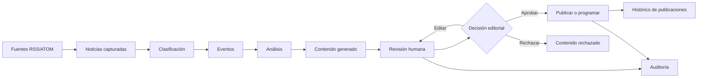
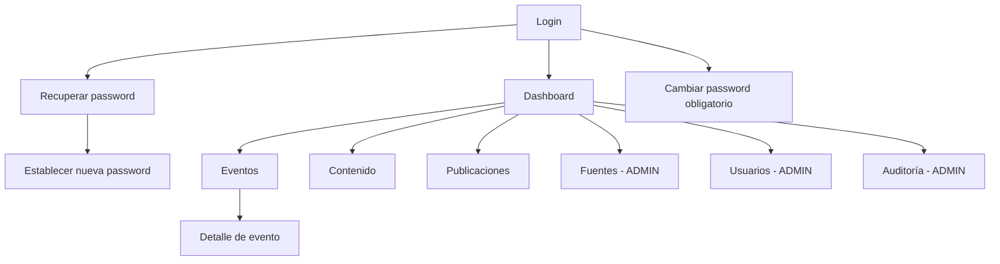
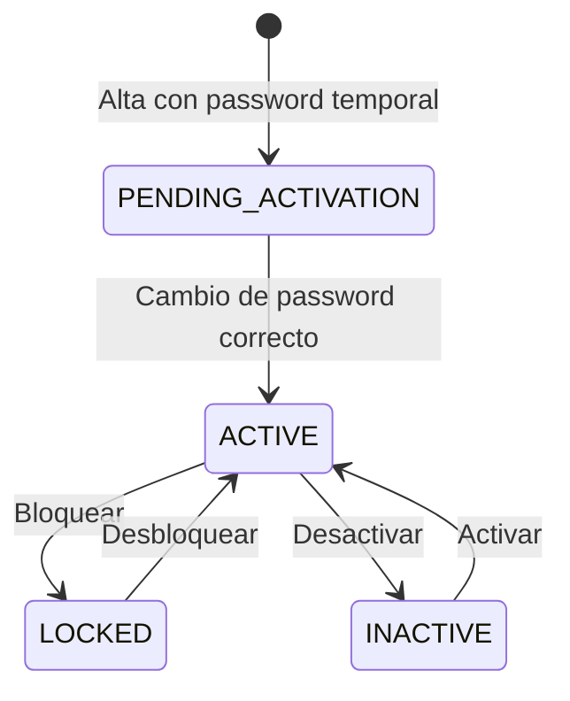
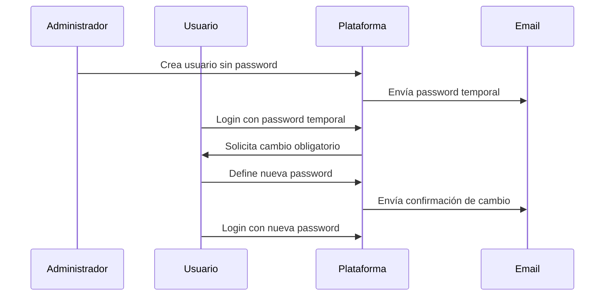
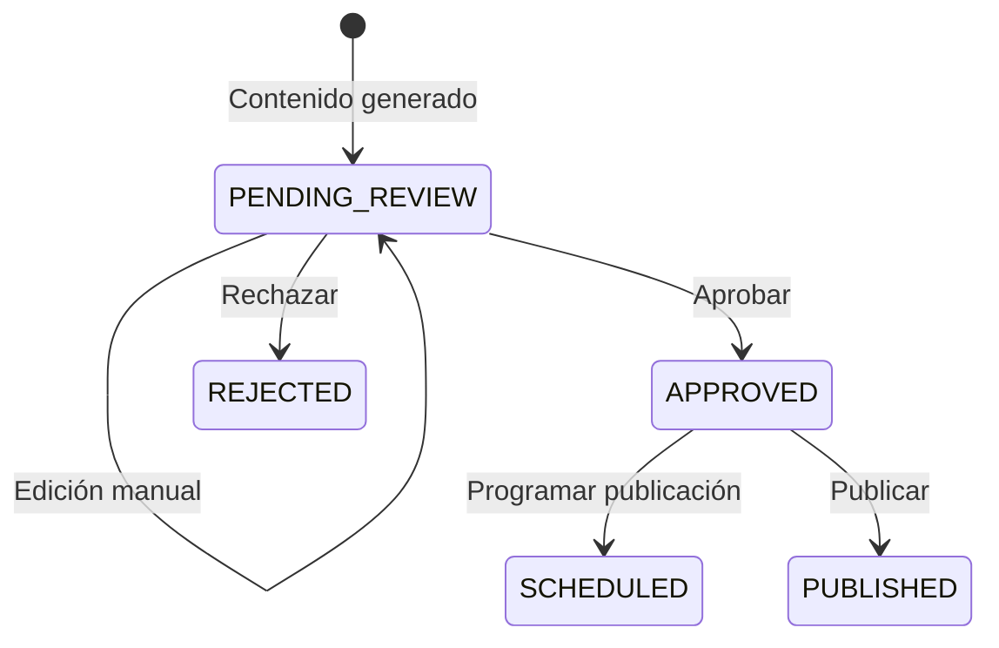
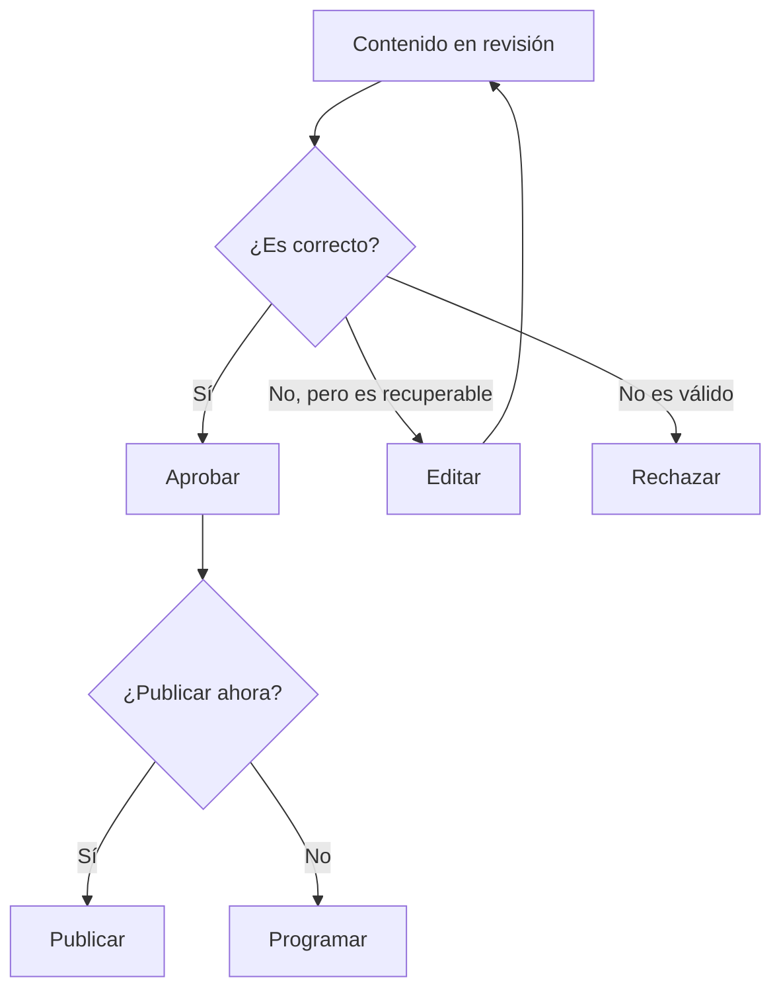
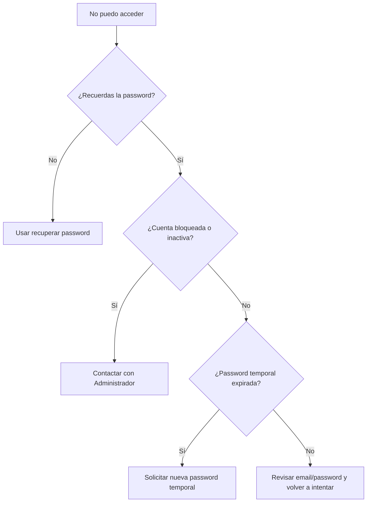
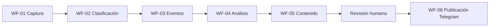

# Manual Operativo de Usuario

Sindicato Intelligence

Version: 1.0

Fecha: 2026-06-13

Estado documentado: cierre validado de Sprint 11

Audiencia: administradores y editores del backoffice

---

## Estándares documentales utilizados

Este manual combina varios tipos profesionales de documentación porque la plataforma no necesita solo una guía de pantallas: necesita una guía de trabajo diaria, formación para nuevos usuarios y procedimientos repetibles.

| Estándar documental | Propósito | Características principales | Ventajas |
| --- | --- | --- | --- |
| User Operations Manual | Explicar cómo operar la plataforma de principio a fin. | Lenguaje no técnico, explicación por módulos, acciones esperadas, resultados visibles. | Permite que una persona nueva aprenda a usar el sistema sin apoyo técnico. |
| Standard Operating Procedures | Describir procedimientos concretos y repetibles. | Objetivo, responsable, precondiciones, pasos, resultado esperado y recuperación ante problemas. | Reduce errores operativos y unifica la forma de trabajar. |
| Role-Based User Guide | Separar la experiencia por rol. | Guías específicas para Administrador y Editor, permisos y restricciones. | Evita confusión sobre qué puede hacer cada perfil. |
| Training and Onboarding Guide | Servir como material de formación inicial. | Escenarios reales, ejemplos, buenas prácticas y preguntas frecuentes. | Facilita la incorporación de nuevos usuarios. |

Esta estructura es adecuada para Sindicato Intelligence porque la plataforma combina automatización, revisión humana y publicación. El usuario no necesita conocer detalles técnicos, pero sí debe entender qué ocurre en cada fase, cuándo intervenir y qué decisiones tomar.

---

## Gaps Detected and Recommendations

Esta sección recoge brechas o mejoras detectadas al preparar el manual. No impiden el uso del MVP validado al cierre de Sprint 11, salvo que se indique lo contrario.

| Gap | Impacto | Recomendación | Prioridad |
| --- | --- | --- | --- |
| No existe todavía un panel de métricas avanzado de IA y workflows para usuarios. | Los usuarios ven el estado operativo básico, pero no métricas detalladas de coste, latencia o errores de IA. | Incorporarlo en Sprint 12 como dashboard de métricas. | Medium |
| La configuración IA por Administrador está documentada como futura. | Los administradores no pueden cambiar proveedor o parámetros IA desde la interfaz. | Mantenerlo como mejora post-MVP o Sprint 12 si se confirma como necesidad operativa. | Medium |
| La monitorización visual de workflows n8n es limitada desde el backoffice. | La ejecución de automatizaciones se verifica fuera de la pantalla principal. | Añadir estado de workflows, últimas ejecuciones y alertas en un módulo operativo. | Medium |
| El canal oficial disponible es Telegram. | No se puede publicar directamente en otros canales sociales desde el MVP. | Mantener Telegram como canal único hasta decidir ampliación. | Low |
| El manual describe flujos n8n como procesos operativos, no como pantallas del backoffice. | Un usuario puede necesitar apoyo técnico si debe operar directamente n8n. | Crear en el futuro una guía específica para operadores n8n si ese rol existe. | Low |
| La documentación histórica tiene algunos textos con caracteres dañados. | Puede dificultar consultas antiguas, pero no afecta al uso del sistema. | Normalizar codificación de documentos históricos cuando se realice limpieza documental. | Low |
| No existe una suite E2E formal versionada para usuarios. | La aceptación se validó localmente, pero no como prueba automatizada completa de interfaz. | Crear prueba E2E del flujo completo como mejora de calidad. | Medium |

Suposiciones usadas en este manual:

- El usuario accede al backoffice desde una URL proporcionada por la organización.
- Los correos de recuperación, password temporal y avisos de cuenta llegan al email corporativo del usuario.
- Telegram es el canal operativo principal de publicación.
- Los workflows automáticos funcionan en segundo plano y no requieren que el Editor los ejecute manualmente.
- Sprint 12 no se documenta como funcionalidad disponible porque aún no está iniciado.

---

## Tabla de contenidos

1. [Introducción](#1-introducción)
2. [Roles y permisos](#2-roles-y-permisos)
3. [Visión general del proceso de negocio](#3-visión-general-del-proceso-de-negocio)
4. [Guía de navegación de la aplicación](#4-guía-de-navegación-de-la-aplicación)
5. [Guía del Administrador](#5-guía-del-administrador)
6. [Guía del Editor](#6-guía-del-editor)
7. [Procedimientos Operativos Estándar](#7-procedimientos-operativos-estándar-sops)
8. [Escenarios de usuario end-to-end](#8-escenarios-de-usuario-end-to-end)
9. [Diagramas](#9-diagramas)
10. [Preguntas frecuentes](#10-preguntas-frecuentes-faq)
11. [Guía de resolución de problemas](#11-guía-de-resolución-de-problemas)
12. [Buenas prácticas](#12-buenas-prácticas)
13. [Glosario](#13-glosario)
14. [Documentation Coverage Report](#documentation-coverage-report)

---

# 1. Introducción

Sindicato Intelligence es una plataforma de backoffice para apoyar el seguimiento editorial de noticias, eventos educativos andaluces, análisis sindical y publicación de contenidos.

La plataforma transforma noticias capturadas desde fuentes RSS en eventos agrupados. Después genera análisis y borradores de contenido para que una persona revise, edite, apruebe y publique de forma controlada.

## Objetivos de negocio

- Detectar información relevante para el ámbito educativo y sindical.
- Agrupar noticias relacionadas en eventos comprensibles.
- Ayudar al equipo editorial a priorizar qué necesita atención.
- Generar análisis y borradores de contenido con apoyo de IA.
- Mantener revisión humana antes de publicar.
- Publicar contenido aprobado en Telegram.
- Registrar acciones relevantes para trazabilidad y auditoría.

## Beneficios principales

- Menos trabajo manual de seguimiento de fuentes.
- Mejor contexto para decidir qué publicar.
- Revisión editorial centralizada.
- Control de usuarios, permisos y estados de cuenta.
- Trazabilidad de acciones administrativas y editoriales.
- Proceso repetible desde noticia hasta publicación.

## Conceptos clave

| Concepto | Significado |
| --- | --- |
| Fuente | Origen RSS o ATOM del que se capturan noticias. |
| Noticia | Pieza informativa capturada por el sistema. |
| Clasificación | Evaluación de una noticia según categoría, impacto y urgencia. |
| Evento | Grupo de una o varias noticias relacionadas. Es la unidad principal de decisión editorial. |
| Análisis | Resumen y evaluación generados para ayudar a entender un evento. |
| Contenido | Borrador editorial preparado para revisión humana. |
| Publicación | Registro de envío o programación del contenido en un canal, actualmente Telegram. |
| Auditoría | Registro de acciones administrativas y editoriales. |
| Password temporal | Password generada por el sistema para activar o recuperar una cuenta. |

---

# 2. Roles y permisos

La plataforma dispone de dos roles: Administrador y Editor.

## Administrador

### Propósito

El Administrador gestiona la operación completa del sistema. Puede operar el flujo editorial y además administrar usuarios, fuentes y auditoría.

### Responsabilidades

- Crear y mantener cuentas de usuario.
- Activar, desactivar, bloquear y desbloquear cuentas.
- Regenerar passwords temporales.
- Revisar auditoría de usuarios y acciones editoriales.
- Mantener fuentes RSS o ATOM.
- Supervisar el flujo editorial completo.

### Permisos

- Acceso al dashboard.
- Acceso a eventos y detalle de eventos.
- Fusión de eventos.
- Acceso a contenido, edición, aprobación, rechazo y programación.
- Acceso a publicaciones.
- Gestión de fuentes.
- Gestión de usuarios.
- Acceso a auditoría.

### Restricciones

- No debe compartir credenciales.
- No debe crear usuarios con emails no verificados.
- No debe desactivar o bloquear cuentas sin motivo operativo.
- No debe publicar contenido sin revisión editorial suficiente.

## Editor

### Propósito

El Editor opera el flujo editorial. Revisa eventos, análisis, contenidos y publicaciones, pero no administra usuarios ni fuentes.

### Responsabilidades

- Revisar eventos detectados.
- Consultar noticias asociadas y análisis.
- Revisar, editar, aprobar o rechazar contenido.
- Programar publicaciones.
- Consultar historial de publicaciones.

### Permisos

- Acceso al dashboard.
- Acceso a eventos y detalle de eventos.
- Fusión de eventos cuando esté disponible en su pantalla.
- Acceso a contenido y revisión editorial.
- Acceso a publicaciones.

### Restricciones

- No puede gestionar usuarios.
- No puede gestionar fuentes.
- No puede consultar la auditoría administrativa.
- No puede cambiar roles o estados de cuenta.

## Tabla comparativa de permisos

| Funcionalidad | Administrador | Editor |
| --- | --- | --- |
| Login | Sí | Sí |
| Cambio obligatorio de password | Sí | Sí |
| Dashboard | Sí | Sí |
| Eventos | Sí | Sí |
| Detalle de evento | Sí | Sí |
| Fusión de eventos | Sí | Sí |
| Bandeja de contenido | Sí | Sí |
| Editar contenido | Sí | Sí |
| Aprobar contenido | Sí | Sí |
| Rechazar contenido | Sí | Sí |
| Programar publicación | Sí | Sí |
| Consultar publicaciones | Sí | Sí |
| Gestionar fuentes | Sí | No |
| Gestionar usuarios | Sí | No |
| Consultar auditoría | Sí | No |

---

# 3. Visión general del proceso de negocio

La plataforma trabaja como una cadena editorial.

## Entradas

- Fuentes RSS o ATOM configuradas.
- Noticias capturadas desde esas fuentes.
- Acciones humanas de revisión, edición y aprobación.

## Procesos

1. El sistema captura noticias desde fuentes activas.
2. Las noticias se clasifican por relevancia, impacto y urgencia.
3. Las noticias se agrupan en eventos.
4. Se genera análisis del evento.
5. Se genera contenido editorial.
6. El usuario revisa y edita el contenido.
7. El usuario aprueba, rechaza, programa o publica.
8. El sistema registra acciones y resultados.

## Salidas

- Eventos consolidados.
- Análisis de contexto.
- Contenido listo para publicación.
- Publicaciones realizadas o programadas.
- Auditoría de acciones.

---

# 4. Guía de navegación de la aplicación

## Mapa de navegación

## Login

### Propósito

Permitir el acceso al backoffice con email y password.

### Cómo acceder

Abrir la URL de la aplicación y entrar en `/login`.

### Elementos visibles

- Email.
- Password.
- Enlace "Olvidé mi password".
- Botón "Entrar".

### Acciones disponibles

- Iniciar sesión.
- Ir a recuperación de password.

### Resultado esperado

- Si las credenciales son correctas, se accede al dashboard.
- Si el usuario debe cambiar password, se redirige a "Cambiar password".
- Si las credenciales son incorrectas, aparece un mensaje de error.

## Recuperar password

### Propósito

Solicitar un enlace de recuperación o una nueva password temporal.

### Cómo acceder

Desde el enlace "Olvidé mi password" en login.

### Elementos visibles

- Campo Email.
- Botón "Enviar enlace de recuperación".
- Enlace de vuelta al login.

### Resultado esperado

El usuario recibe un correo si el email existe y cumple las condiciones del flujo solicitado.

## Establecer nueva password

### Propósito

Definir una password nueva usando un token de recuperación.

### Elementos visibles

- Nueva password.
- Confirmar password.
- Botón "Actualizar password".

### Reglas visibles

La password debe tener al menos 10 caracteres, mayúscula, minúscula, número y símbolo.

## Cambiar password

### Propósito

Obligar al usuario a sustituir una password temporal por una definitiva.

### Resultado esperado

Tras cambiar correctamente la password, se muestra confirmación y el usuario debe volver a iniciar sesión.

## Dashboard

### Propósito

Mostrar una lectura rápida del estado editorial.

### Cómo acceder

Menú lateral: Dashboard.

### Elementos visibles

- Tarjetas de métricas.
- Tabla de eventos prioritarios.
- Estados de eventos.

### Acciones disponibles

- Revisar carga editorial.
- Identificar eventos que requieren decisión.
- Navegar al resto de secciones desde el menú.

## Eventos

### Propósito

Consultar eventos detectados y fusionar eventos relacionados.

### Elementos visibles

- Panel "Fusionar eventos".
- Selector de evento destino.
- Lista de eventos origen.
- Botón "Fusionar".
- Tabla de eventos.
- Acción "Ver".

### Filtros

La pantalla muestra etiquetas informativas como SIPRI, OPEN, HIGH y últimas 48h. Si la organización define filtros operativos adicionales, deberán aplicarse según procedimiento interno.

### Resultado esperado

El usuario puede revisar eventos y abrir su detalle. Si fusiona eventos, el destino conserva la información y los eventos origen quedan archivados.

## Detalle de evento

### Propósito

Ver el contexto completo de un evento.

### Elementos visibles

- Título, descripción, categoría, impacto y estado.
- Contadores de noticias, análisis y contenidos.
- Noticias asociadas.
- Análisis IA.
- Contenido generado.
- Enlace para volver a eventos.

### Acciones disponibles

- Revisar noticias originales.
- Consultar análisis.
- Comprobar contenido generado.

## Contenido

### Propósito

Revisar, editar, aprobar, rechazar y programar contenido.

### Elementos visibles

- Vista previa del contenido seleccionado.
- Formulario de edición: título, tono y contenido.
- Formulario de programación.
- Tabla de contenidos.
- Botones "Editar", "Aprobar" y "Rechazar".

### Reglas visibles

- El contenido publicado no se puede editar.
- Solo se puede aprobar o rechazar contenido en revisión.
- Solo se puede programar contenido aprobado.

## Publicaciones

### Propósito

Consultar el histórico operativo de publicaciones de Telegram.

### Elementos visibles

- Tarjetas de publicación.
- Canal.
- Estado.
- Fecha de publicación o programación.
- Resultado o respuesta registrada.

## Fuentes

### Propósito

Gestionar fuentes RSS o ATOM utilizadas por la captura automática.

### Acceso

Solo Administrador.

### Elementos visibles

- Formulario de fuente.
- Nombre.
- URL.
- Tipo RSS o ATOM.
- Prioridad.
- Estado activa/inactiva.
- Tabla de fuentes registradas.
- Botones "Crear", "Guardar", "Limpiar" y "Editar".

## Usuarios

### Propósito

Administrar cuentas de acceso.

### Acceso

Solo Administrador.

### Elementos visibles

- Formulario de alta o edición.
- Email.
- Nombre.
- Rol.
- Tabla de usuarios.
- Estado.
- Último login.
- Último cambio de password.
- Expiración de password temporal.
- Acciones: editar, activar, desactivar, bloquear, desbloquear y reset temporal.

## Auditoría

### Propósito

Consultar trazabilidad administrativa y editorial.

### Acceso

Solo Administrador.

### Elementos visibles

- Botón "Actualizar".
- Pestaña Usuarios.
- Pestaña Editorial.
- Fecha, acción, usuario, actor, entidad y cambios.

---

# 5. Guía del Administrador

## Crear un usuario

### Propósito

Dar acceso a una nueva persona.

### Cuándo usarlo

Cuando se incorpora un Administrador o Editor.

### Prerrequisitos

- Tener rol Administrador.
- Conocer email, nombre y rol.

### Entradas requeridas

- Email único.
- Nombre completo.
- Rol: ADMIN o EDITOR.

### Pasos

1. Entrar en Usuarios.
2. Completar Email, Nombre y Rol.
3. Pulsar "Crear usuario".
4. Confirmar que aparece mensaje de éxito.
5. Informar a la persona de que recibirá una password temporal por email.

### Resultado esperado

La cuenta queda en estado PENDING_ACTIVATION y el sistema envía una password temporal.

### Posibles errores

- Email inválido.
- Email ya existente.
- Campos obligatorios vacíos.

### Buenas prácticas

- Crear cuentas nominativas.
- No reutilizar emails compartidos.
- Asignar solo el rol necesario.

### Ejemplo real

Crear una cuenta `editor@sindicato.es` con rol EDITOR para una persona del equipo editorial.

## Gestionar estado de cuentas

### Propósito

Controlar quién puede acceder.

### Acciones

- Activar: permite acceso si la cuenta está habilitada.
- Desactivar: impide acceso sin borrar la cuenta.
- Bloquear: impide acceso por decisión administrativa.
- Desbloquear: restaura acceso según el estado de password.
- Reset temporal: genera nueva password temporal.

### Reglas

- Las cuentas no se eliminan físicamente.
- Desactivar y bloquear envían notificación.
- Reset temporal envía nueva password temporal.

## Gestionar fuentes

### Propósito

Mantener los orígenes desde los que se capturan noticias.

### Pasos

1. Entrar en Fuentes.
2. Crear o editar fuente.
3. Revisar URL y tipo.
4. Ajustar prioridad.
5. Marcar activa o inactiva.
6. Guardar.

### Resultado esperado

Las fuentes activas quedan disponibles para la captura automática.

## Revisar auditoría

### Propósito

Comprobar quién hizo qué y cuándo.

### Pasos

1. Entrar en Auditoría.
2. Elegir Usuarios o Editorial.
3. Revisar acción, fecha, actor y detalle.
4. Pulsar "Actualizar" si se necesitan datos recientes.

### Ejemplo real

Revisar si una cuenta fue bloqueada y qué usuario administrador ejecutó la acción.

---

# 6. Guía del Editor

## Revisar eventos

### Propósito

Entender qué hechos relevantes se han detectado.

### Pasos

1. Entrar en Eventos.
2. Revisar impacto, categoría, noticias y estado.
3. Abrir "Ver" en el evento que requiera análisis.
4. Leer noticias asociadas, análisis y contenido.

## Fusionar eventos

### Propósito

Unificar eventos duplicados o relacionados.

### Pasos

1. Entrar en Eventos.
2. Elegir evento destino.
3. Marcar uno o varios eventos origen.
4. Pulsar "Fusionar".
5. Confirmar que aparece mensaje de éxito.

### Resultado esperado

Las noticias de los eventos origen pasan al evento destino. Los eventos origen quedan archivados.

## Revisar y editar contenido

### Propósito

Asegurar que el contenido publicado es correcto, claro y adecuado.

### Pasos

1. Entrar en Contenido.
2. Seleccionar un elemento con "Editar".
3. Revisar título, tono y contenido.
4. Modificar lo necesario.
5. Guardar cambios.
6. Aprobar o rechazar.

### Resultado esperado

El contenido aprobado queda listo para publicación o programación.

## Programar publicación

### Propósito

Preparar contenido aprobado para publicarse en una fecha futura.

### Pasos

1. Seleccionar contenido aprobado.
2. Elegir fecha y hora futura.
3. Pulsar "Programar".
4. Confirmar mensaje de éxito.

## Consultar publicaciones

### Propósito

Ver qué se publicó, qué está programado y qué falló.

### Pasos

1. Entrar en Publicaciones.
2. Revisar estado de cada tarjeta.
3. Revisar fecha y respuesta registrada.

---

# 7. Procedimientos Operativos Estándar (SOPs)

## SOP 1. Login

| Campo | Detalle |
| --- | --- |
| Objetivo | Acceder al backoffice. |
| Responsable | Administrador o Editor. |
| Precondiciones | Cuenta activa y credenciales válidas. |
| Procedimiento | Abrir login, escribir email y password, pulsar Entrar. |
| Resultado esperado | Acceso al dashboard o redirección a cambio de password. |
| Posibles issues | Credenciales incorrectas, cuenta bloqueada, cuenta inactiva. |
| Recuperación | Usar recuperación de password o contactar con Administrador. |

## SOP 2. Primer login con password temporal

| Campo | Detalle |
| --- | --- |
| Objetivo | Cambiar password temporal por una definitiva. |
| Responsable | Usuario nuevo. |
| Precondiciones | Haber recibido password temporal por email. |
| Procedimiento | Login con password temporal, completar cambio de password, volver a iniciar sesión. |
| Resultado esperado | Acceso normal al backoffice. |
| Posibles issues | Password temporal expirada o no recibida. |
| Recuperación | Solicitar nueva password temporal. |

## SOP 3. Recuperación de password

| Campo | Detalle |
| --- | --- |
| Objetivo | Recuperar acceso si el usuario olvidó su password. |
| Responsable | Usuario. |
| Precondiciones | Cuenta registrada. |
| Procedimiento | Ir a Olvidé mi password, introducir email, usar enlace o token recibido, establecer nueva password. |
| Resultado esperado | Password actualizada. |
| Posibles issues | Token expirado, email incorrecto. |
| Recuperación | Solicitar nuevo enlace. |

## SOP 4. Solicitar nueva password temporal

| Campo | Detalle |
| --- | --- |
| Objetivo | Obtener nueva password temporal cuando la anterior expiró. |
| Responsable | Usuario. |
| Precondiciones | Cuenta con password temporal expirada o pendiente. |
| Procedimiento | En Recuperar password, introducir email y pulsar "Solicitar nueva password temporal". |
| Resultado esperado | Llegada de nuevo correo si aplica. |
| Posibles issues | La cuenta no existe o la password temporal no ha expirado. |
| Recuperación | Contactar con Administrador. |

## SOP 5. Alta de usuario

| Campo | Detalle |
| --- | --- |
| Objetivo | Crear una cuenta. |
| Responsable | Administrador. |
| Precondiciones | Email único y rol definido. |
| Procedimiento | Usuarios, completar formulario, crear usuario. |
| Resultado esperado | Usuario PENDING_ACTIVATION y correo con password temporal. |
| Posibles issues | Email inválido o duplicado. |
| Recuperación | Corregir datos y repetir. |

## SOP 6. Activar, desactivar, bloquear y desbloquear usuarios

| Campo | Detalle |
| --- | --- |
| Objetivo | Controlar acceso sin borrar cuentas. |
| Responsable | Administrador. |
| Precondiciones | Usuario existente. |
| Procedimiento | Usuarios, localizar fila, pulsar acción correspondiente. |
| Resultado esperado | Estado actualizado y auditoría registrada. |
| Posibles issues | Acción aplicada a usuario incorrecto. |
| Recuperación | Aplicar acción inversa y revisar auditoría. |

## SOP 7. Reset temporal de usuario

| Campo | Detalle |
| --- | --- |
| Objetivo | Generar nueva password temporal. |
| Responsable | Administrador. |
| Precondiciones | Usuario existente. |
| Procedimiento | Usuarios, pulsar "Reset temporal". |
| Resultado esperado | Email con nueva password temporal. |
| Posibles issues | Usuario no recibe correo. |
| Recuperación | Verificar email y repetir reset. |

## SOP 8. Revisión de contenido

| Campo | Detalle |
| --- | --- |
| Objetivo | Asegurar calidad antes de publicar. |
| Responsable | Administrador o Editor. |
| Precondiciones | Contenido generado en bandeja. |
| Procedimiento | Seleccionar contenido, revisar, editar si procede, aprobar o rechazar. |
| Resultado esperado | Contenido aprobado, rechazado o pendiente tras edición. |
| Posibles issues | Contenido incompleto o incorrecto. |
| Recuperación | Editar manualmente o rechazar. |

## SOP 9. Publicación inmediata

| Campo | Detalle |
| --- | --- |
| Objetivo | Publicar contenido aprobado. |
| Responsable | Administrador o Editor. |
| Precondiciones | Contenido aprobado. |
| Procedimiento | Usar acción de publicación disponible en el flujo operativo. |
| Resultado esperado | Publicación PUBLISHED en historial. |
| Posibles issues | Error del canal Telegram. |
| Recuperación | Revisar Publicaciones y reintentar según procedimiento interno. |

## SOP 10. Programación de publicación

| Campo | Detalle |
| --- | --- |
| Objetivo | Preparar publicación futura. |
| Responsable | Administrador o Editor. |
| Precondiciones | Contenido aprobado. |
| Procedimiento | Elegir fecha futura en Contenido y pulsar Programar. |
| Resultado esperado | Publicación SCHEDULED. |
| Posibles issues | Fecha pasada o contenido no aprobado. |
| Recuperación | Corregir fecha o aprobar contenido. |

## SOP 11. Gestión de notificaciones

| Campo | Detalle |
| --- | --- |
| Objetivo | Confirmar que los usuarios reciben avisos relevantes. |
| Responsable | Administrador. |
| Precondiciones | Email correcto. |
| Procedimiento | Revisar que el usuario recibe correos de password, bloqueo o desactivación. |
| Resultado esperado | Usuario informado de cambios de cuenta. |
| Posibles issues | Correo no recibido. |
| Recuperación | Verificar email, revisar spam o generar nuevo reset temporal. |

---

# 8. Escenarios de usuario end-to-end

## Nuevo Administrador

1. Recibe password temporal.
2. Entra por primera vez.
3. Cambia su password.
4. Accede al dashboard.
5. Revisa usuarios y fuentes.
6. Consulta auditoría.
7. Supervisa eventos, contenidos y publicaciones.

## Nuevo Editor

1. Recibe password temporal.
2. Cambia password en primer login.
3. Entra al dashboard.
4. Revisa eventos prioritarios.
5. Abre detalle de evento.
6. Revisa análisis y contenido.
7. Edita el contenido.
8. Aprueba y programa publicación.

## Ciclo completo de contenido

1. El sistema detecta noticias.
2. Las noticias se agrupan en un evento.
3. Se genera análisis.
4. Se genera contenido.
5. El Editor revisa y edita.
6. El Editor aprueba.
7. El contenido se publica o programa.
8. El resultado aparece en Publicaciones.

## Ciclo de vida de usuario

1. Administrador crea usuario.
2. Sistema envía password temporal.
3. Usuario cambia password.
4. Usuario opera normalmente.
5. Administrador bloquea o desactiva si es necesario.
6. Todas las acciones quedan auditadas.

---

# 9. Diagramas

## Estado de usuario

## Flujo de primer login

## Estado del contenido

## Decisión editorial

## Resolución de problemas de acceso

## Flujo de workflows operativos

---

# 10. Preguntas frecuentes (FAQ)

## ¿Puedo crear un usuario con una password manual?

No. El sistema genera una password temporal automáticamente y la envía por email.

## ¿Qué hago si un usuario no recibe la password temporal?

Verifica que el email sea correcto y usa "Reset temporal". Si persiste, revisa el canal de correo definido por la organización.

## ¿Puede un Editor gestionar usuarios?

No. Solo el Administrador puede acceder a Usuarios.

## ¿Puede un Editor editar contenido?

Sí. El Editor puede revisar y editar contenido mientras no esté publicado.

## ¿Por qué no puedo editar un contenido?

Probablemente ya está publicado. El contenido publicado queda bloqueado para edición.

## ¿Por qué no puedo programar una publicación?

Solo se puede programar contenido aprobado y con fecha futura.

## ¿Qué significa PENDING_REVIEW?

El contenido está pendiente de revisión humana.

## ¿Qué significa SCHEDULED?

La publicación está programada para una fecha futura.

## ¿Qué significa LOCKED?

La cuenta está bloqueada por un Administrador y no puede acceder.

## ¿Dónde veo quién hizo un cambio?

En Auditoría, disponible para Administradores.

## ¿Puedo publicar en canales distintos de Telegram?

En el estado actual del MVP, Telegram es el canal operativo documentado.

---

# 11. Guía de resolución de problemas

| Problema | Síntomas | Posibles causas | Resolución | Escalado |
| --- | --- | --- | --- | --- |
| No puedo iniciar sesión | Error al entrar | Email o password incorrectos | Revisar credenciales o usar recuperación | Administrador |
| Me obliga a cambiar password | Redirección a Cambiar password | Cuenta nueva o reset temporal | Completar cambio de password | Administrador si falla |
| No recibo correo | No llega password o reset | Email incorrecto, correo retrasado, spam | Revisar email y solicitar nuevo envío | Administrador |
| No veo Usuarios | Menú no muestra Usuarios | Rol Editor | Solicitar acción a Administrador | Administrador |
| No veo Fuentes | Menú no muestra Fuentes | Rol Editor | Solicitar cambio a Administrador si procede | Administrador |
| No veo Auditoría | Menú no muestra Auditoría | Rol Editor | Solicitar revisión a Administrador | Administrador |
| No puedo aprobar contenido | Botón deshabilitado | Estado distinto de PENDING_REVIEW | Seleccionar contenido pendiente | Responsable editorial |
| No puedo programar | Botón deshabilitado | Contenido no aprobado o fecha inválida | Aprobar contenido y elegir fecha futura | Responsable editorial |
| Publicación fallida | Estado FAILED | Error de canal o configuración externa | Revisar historial y reintentar según procedimiento | Soporte técnico |
| Evento duplicado | Dos eventos describen el mismo hecho | Agrupación automática no los unió | Usar fusión de eventos | Editor o Administrador |

---

# 12. Buenas prácticas

## Administradores

- Crear usuarios con email corporativo individual.
- Usar el rol mínimo necesario.
- Revisar periódicamente usuarios inactivos.
- Bloquear cuentas ante sospecha de uso indebido.
- No eliminar trazabilidad operativa.
- Revisar auditoría antes de investigar incidencias.
- Mantener fuentes activas solo si aportan información útil.

## Editores

- Revisar siempre noticias y análisis antes de aprobar contenido.
- Editar títulos para que sean claros y adecuados.
- No publicar contenido que no represente correctamente el criterio editorial.
- Usar programación cuando la publicación deba salir en un momento concreto.
- Revisar el historial de publicaciones para confirmar resultado.
- Fusionar eventos duplicados antes de generar decisiones editoriales.

---

# 13. Glosario

| Término | Definición |
| --- | --- |
| Administrador | Usuario con permisos completos de operación y administración. |
| Editor | Usuario centrado en revisión editorial y publicación. |
| Backoffice | Aplicación interna usada por el equipo. |
| Dashboard | Pantalla de resumen operativo. |
| Fuente | Origen RSS o ATOM desde el que se capturan noticias. |
| Noticia | Información capturada desde una fuente. |
| Evento | Agrupación de noticias relacionadas. |
| Merge | Fusión de varios eventos en uno. |
| Análisis IA | Resumen y evaluación generados para un evento. |
| Contenido | Borrador preparado para revisión editorial. |
| PENDING_REVIEW | Estado de contenido pendiente de revisión. |
| APPROVED | Estado de contenido aprobado. |
| REJECTED | Estado de contenido rechazado. |
| PUBLISHED | Estado de contenido o publicación ya publicada. |
| SCHEDULED | Publicación programada para una fecha futura. |
| FAILED | Publicación fallida. |
| Password temporal | Password generada por el sistema para activar o recuperar una cuenta. |
| PENDING_ACTIVATION | Cuenta pendiente de cambio de password inicial. |
| ACTIVE | Cuenta activa. |
| INACTIVE | Cuenta desactivada. |
| LOCKED | Cuenta bloqueada. |
| Auditoría | Registro de acciones relevantes. |
| Telegram | Canal de publicación operativo del MVP. |

---

# Documentation Coverage Report

## Funcionalidades documentadas

- Login.
- Recuperación de password.
- Reset de password.
- Solicitud de nueva password temporal.
- Primer login con cambio obligatorio.
- Dashboard.
- Eventos.
- Detalle de evento.
- Fusión de eventos.
- Bandeja de contenido.
- Edición manual de contenido.
- Aprobación y rechazo.
- Programación de publicaciones.
- Publicación inmediata.
- Historial de publicaciones.
- Gestión de fuentes.
- Gestión de usuarios.
- Activación, desactivación, bloqueo, desbloqueo y reset temporal.
- Auditoría de usuarios y editorial.
- Workflows operativos WF-01 a WF-06 desde perspectiva funcional.
- Notificaciones por email relevantes para usuarios.

## Roles documentados

- Administrador.
- Editor.

## Pantallas documentadas

- `/login`.
- `/forgot-password`.
- `/reset-password`.
- `/change-password`.
- `/dashboard`.
- `/events`.
- `/events/:id`.
- `/content`.
- `/publications`.
- `/sources`.
- `/users`.
- `/audit`.

## Permisos documentados

- Acceso general por rol.
- Restricciones de Administrador y Editor.
- Pantallas exclusivas de Administrador.
- Acciones editoriales disponibles para Administrador y Editor.

## Workflows documentados

- Captura de noticias.
- Clasificación.
- Detección de eventos.
- Generación de análisis.
- Generación de contenido.
- Publicación Telegram.

## Información faltante o futura

- Métricas avanzadas de IA.
- Monitorización visual de workflows.
- Configuración IA desde interfaz de Administrador.
- Canales sociales adicionales a Telegram.
- Guía específica para operación directa de n8n, si se crea ese rol.

## Suposiciones realizadas

- Los usuarios finales no operan infraestructura ni base de datos.
- Los usuarios reciben emails en un buzón corporativo.
- Telegram es el canal de publicación disponible.
- Las automatizaciones n8n se consideran procesos de fondo desde el punto de vista de usuario.
- El manual refleja el sistema validado al cierre de Sprint 11.

## Mejoras recomendadas de documentación

- Crear capturas de pantalla cuando la interfaz se estabilice visualmente.
- Crear guía rápida de una página para Administradores.
- Crear guía rápida de una página para Editores.
- Añadir un anexo de formación con ejercicios prácticos.
- Crear manual separado para operadores técnicos de n8n si se necesita.
